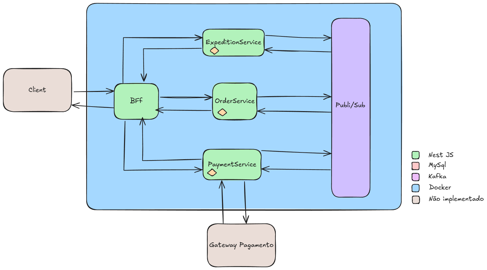

# Ecommerce API 🚀


Este repositório contém um projeto de arquitetura de microsserviços para um sistema de ecommerce, desenvolvido com **NestJS**, **Kafka**, **Prisma** e **MySQL**, utilizando **Docker**.

## 📦 Estrutura do Projeto

```
ecommerce_api/
│── .docker/                # Scripts e configurações do banco MySQL
│── bff/                    # Backend For Frontend (BFF) para consumir e orquestrar os serviços
│── checkout/               # Serviço responsável pela criação e consulta de pedidos
|── payments/               # Serviço responsável pelo processamento de pagamentos
│── expeditions/            # Serviço responsável pela gestão de expedições
│── docker-compose.yml      # Orquestração dos serviços Docker
│── README.md               # Documentação do projeto
```

## 🛠️ Tecnologias Utilizadas

- **NestJS** - Framework Node.js para construção de aplicações escaláveis
- **Kafka** - Plataforma de mensageria para comunicação assíncrona
- **Prisma ORM** - Gerenciador de banco de dados
- **MySQL** - Banco de dados relacional
- **Docker** - Containerização dos serviços

## 🚀 Executando o Projeto

### Pré-requisitos

- Docker e Docker Compose instalados

### Rodar o Projeto

1. Clone o repositório:
    ```bash
    git clone https://github.com/HenriqueRicardoFigueira/ecommerce_api.git
    ```
2. Acesse o diretório do projeto:
    ```bash
    cd ecommerce_api
    ```
3. Execute o Docker Compose:
    ```bash
    docker-compose up --build
    ```
4. Execute o script abaixo para gerar as migrações:
  ```bash
    ./run_migrations
  ```

Isso irá iniciar os seguintes serviços:
- BFF rodando na porta **3000**
- Kafka e Zookeeper
- MySQL rodando na porta **3306**
- Serviço Checkout
- Control Center do Kafka na porta **9021**

## 🧪 Testes

Dentro de cada microserviço, você pode rodar os testes com:
```bash
npm run test
```
Para testes end-to-end:
```bash
npm run test:e2e
```

## 🔥 Funcionalidades

- Criar pedidos
- Listar pedidos
- Comunicação assíncrona entre serviços via Kafka
- Persistência de dados em MySQL


## 📚 Referẽncias

- https://docs.nestjs.com/
- https://github.com/confluentinc/cp-all-in-one/blob/7.8.0-post/cp-all-in-one/docker-compose.yml
- https://github.com/devfullcycle/live-imersao-13-nestjs-kafka
- https://www.youtube.com/watch?v=z87Yo6j_iK8
- https://victorfjansen.com/bffs-pra-tratativa-de-dados-com-nestjs-dbfde05bdce8
- https://dev.to/chukwutosin_/step-by-step-guide-setting-up-a-nestjs-application-with-docker-and-postgresql-5hei

## 🧑‍💻 Autor

[Henrique Ricardo Figueira](https://github.com/HenriqueRicardoFigueira)

---
